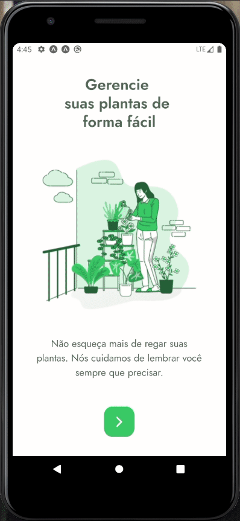

# 🌿🌵🌱 Plant Manager App 🌱🌵🌿

<p align="center">
  <a href="./LICENSE">
  
  </a>
  
  
  
  
  
  
  
</p>

<p align="center">

</p>

## Objetivo

O NLW é um evento online com muito código, desafios, networking e um único objetivo: ir para o próximo nível.

<br>

## Aprendizado
### Prática
Existem muitas formas de estudar programação, mas só existe uma forma de aprender: na prática. A teoria só funciona se você souber onde e quando aplicar, e são as horas de código que vão te ensinar a tomar as melhores decisões.

### Foco
Programação é um universo infinito, por isso ter foco é o primeiro passo para atingir seus objetivos. Saber onde você quer chegar e não se distrair com aquilo que não faz sentido para o seu momento, é a melhor forma de acelerar sua evolução

### Comunidade
Para se destacar é preciso ter habilidades que vão além do código, e a melhor forma de dominar essas habilidades também é na prática. Ajudar outros devs, se posicionar e receber feedback formam o bom profissional.

<br>

## Instalação
Este projeto utiliza o [Expo](https://expo.io/).

Você precisará ter apenas o [NodeJS](https://nodejs.org) instalado na sua máquina, e após isso, clonar este repositório:
```bash
  $ git clone https://github.com/leandross86/PlantManager_NLW5_React-Native
```

Depois acesse o diretório e instale as dependências executando o seguinte comando:
```bash
  $ yarn install # ou npm install
```

## Executando a aplicação

Execute o comando a baixo para inicializar o Expo:
```bash
  $ expo start # ou npm start ou yarn start

```
## Executando o servidor

Execute o comando a baixo para inicializar o servidor backend:
```bash
  $ json-server ./src/services/server.json --host {seu host} --port 3333 --delay 5000
```

Agora basta abrir o emulador pelo seu computador, ou o aplicativo do Expo no seu celular (disponível na [App Store](https://apps.apple.com/br/app/expo-client/id982107779) e na [Google Play](https://play.google.com/store/apps/details?id=host.exp.exponent&hl=pt_BR)).

<br>

## Como contribuir

- Fork esse repositório;
- Crie uma branch com a sua feature: `git checkout -b my-feature`
- Commit suas mudanças: `git commit -m 'feat: My new feature'`
- Push a sua branch: `git push origin my-feature`

Depois que o merge da sua pull request for feito, você pode deletar a sua branch.

## Licença

Esse projeto está sob a licença MIT. Veja o arquivo [LICENSE](LICENSE) para mais detalhes.

## 🤝 Créditos

### [Rocketseat](https://rocketseat.com.br/)
#### A primeira coisa que você precisa saber sobre a jornada como dev é que o aprendizado é contínuo e sempre haverá um próximo nível


<br>
<p align="center">
Desenvolvido com ❤️ por Leandro Souza
</p>
